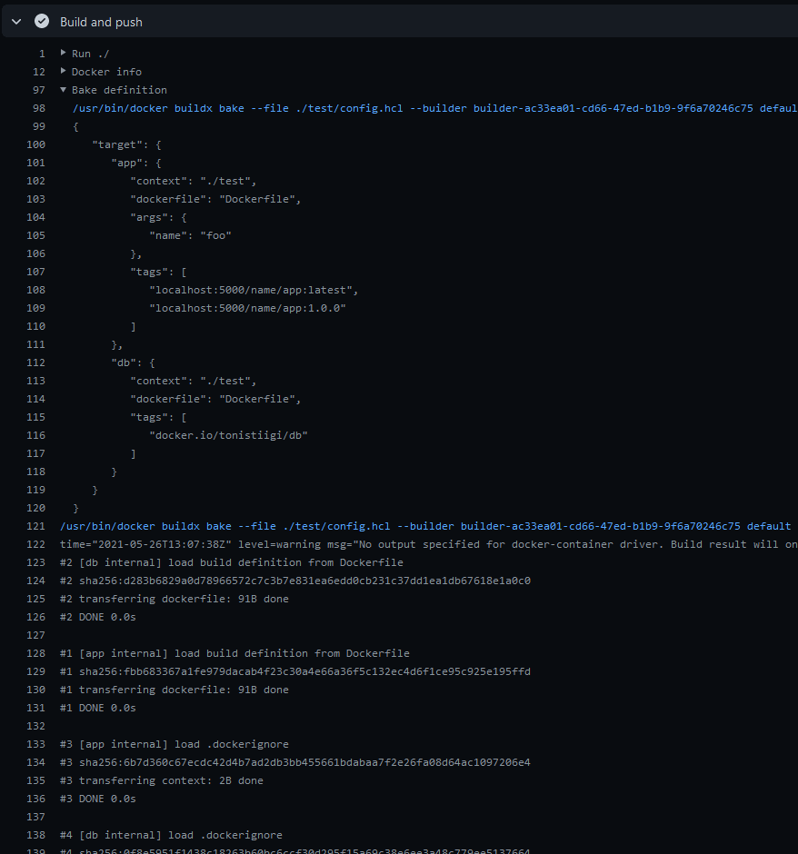
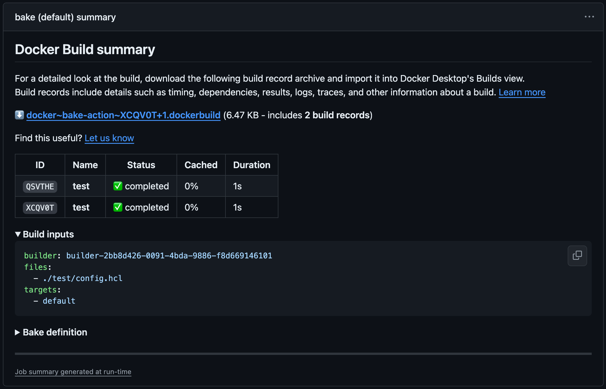

[](https://docs.stepsecurity.io/actions/stepsecurity-maintained-actions)

## About

GitHub Action to use Docker [Buildx Bake](https://docs.docker.com/build/customize/bake/)
as a high-level build command.



___

* [Usage](#usage)
  * [Git context](#git-context)
  * [Path context](#path-context)
* [Summaries](#summaries)
* [Customizing](#customizing)
  * [inputs](#inputs)
  * [outputs](#outputs)
  * [environment variables](#environment-variables)
* [Subactions](#subactions)
  * [`matrix`](subaction/matrix)
* [Notes](#notes)
  * [Source semantics](#source-semantics)

## Usage

### Git context

The git reference will be based on the [event that triggered your workflow](https://docs.github.com/en/actions/using-workflows/events-that-trigger-workflows)
and will result in the following context: `https://github.com/<owner>/<repo>.git#<ref>`.

```yaml
name: ci

on:
  push:

jobs:
  bake:
    runs-on: ubuntu-latest
    steps:
      -
        name: Login to DockerHub
        uses: step-security/docker-login-action@v4
        with:
          username: ${{ vars.DOCKERHUB_USERNAME }}
          password: ${{ secrets.DOCKERHUB_TOKEN }}
      -
        name: Set up Docker Buildx
        uses: step-security/setup-buildx-action@v4
      -
        name: Build and push
        uses: step-security/docker-bake-action@v7
        with:
          push: true
          set: |
            *.tags=user/app:latest
```

Be careful because **any file mutation in the steps that precede the build step
will be ignored, including processing of the `.dockerignore` file** since
the context is based on the Git reference. However, you can use the
[Path context](#path-context) using the [`source` input](#inputs) alongside
the [`actions/checkout`](https://github.com/actions/checkout/) action to remove
this restriction.

Default Git context can also be provided using the [Handlebars template](https://handlebarsjs.com/guide/)
expression `{{defaultContext}}`. Here we can use it to provide a subdirectory
to the default Git context:

```yaml
      -
        name: Build and push
        uses: step-security/docker-bake-action@v7
        with:
          source: "{{defaultContext}}:mysubdir"
          push: true
          set: |
            *.tags=user/app:latest
```

Building from the current repository automatically uses the `GITHUB_TOKEN`
secret that GitHub [automatically creates for workflows](https://docs.github.com/en/actions/security-guides/automatic-token-authentication),
so you don't need to pass that manually. If you want to authenticate against
another private repository for remote definitions, you can set the
[`BUILDX_BAKE_GIT_AUTH_TOKEN` environment variable](https://docs.docker.com/build/building/variables/#buildx_bake_git_auth_token).

> [!NOTE]
> Supported since Buildx 0.14.0

```yaml
      -
        name: Build and push
        uses: step-security/docker-bake-action@v7
        with:
          push: true
          set: |
            *.tags=user/app:latest
        env:
          BUILDX_BAKE_GIT_AUTH_TOKEN: ${{ secrets.MYTOKEN }}
```

### Path context

```yaml
name: ci

on:
  push:

jobs:
  bake:
    runs-on: ubuntu-latest
    steps:
      -
        name: Checkout
        uses: actions/checkout@v7
      -
        name: Login to DockerHub
        uses: step-security/docker-login-action@v4
        with:
          username: ${{ vars.DOCKERHUB_USERNAME }}
          password: ${{ secrets.DOCKERHUB_TOKEN }}
      -
        name: Set up Docker Buildx
        uses: step-security/setup-buildx-action@v4
      -
        name: Build and push
        uses: step-security/docker-bake-action@v7
        with:
          source: .
          push: true
          set: |
            *.tags=user/app:latest
```

If you point `source` to a subdirectory, relative paths are resolved from that
subdirectory:

```yaml
      -
        name: Build and push
        uses: step-security/docker-bake-action@v7
        with:
          source: ./subdir
          files: ./docker-bake.hcl
```

For example, if `./subdir/docker-bake.hcl` contains:

```hcl
target "default" {
  output = ["type=local,dest=./artifacts"]
}
```

The output will be written to `./subdir/artifacts` in the workspace.

> [!NOTE]
> More info about `source` semantics in the [Source semantics](#source-semantics) section.

## Summaries

This action generates a [job summary](https://github.blog/2022-05-09-supercharging-github-actions-with-job-summaries/)
that provides a detailed overview of the build execution. The summary shows an
overview of all the steps executed during the build, including the build
inputs, bake definition, and eventual errors.



The summary also includes a link for downloading a build record archive with
additional details about the build execution for all the bake targets,
including build stats, logs, outputs, and more. The build record can be
imported to Docker Desktop for inspecting the build in greater detail.

> [!WARNING]
>
> If you're using the [`actions/download-artifact`](https://github.com/actions/download-artifact)
> action in your workflow, you need to ignore the build record artifacts
> if `name` and `pattern` inputs are not specified ([defaults to download all artifacts](https://github.com/actions/download-artifact?tab=readme-ov-file#download-all-artifacts) of the workflow),
> otherwise the action will fail:
> ```yaml
> - uses: actions/download-artifact@v8
>   with:
>     pattern: "!*.dockerbuild"
> ```
> More info: https://github.com/actions/toolkit/pull/1874

Summaries are enabled by default, but can be disabled with the
`DOCKER_BUILD_SUMMARY` [environment variable](#environment-variables).

For more information about summaries, refer to the
[documentation](https://docs.docker.com/go/build-summary/).

## Customizing

### inputs

The following inputs can be used as `step.with` keys

> `List` type is a newline-delimited string
> ```yaml
> set: target.args.mybuildarg=value
> ```
> ```yaml
> set: |
>   target.args.mybuildarg=value
>   foo*.args.mybuildarg=value
> ```

> `CSV` type is a comma-delimited string
> ```yaml
> targets: default,release
> ```

| Name           | Type        | Description                                                                                                                                                                                                                                                            |
|----------------|-------------|------------------------------------------------------------------------------------------------------------------------------------------------------------------------------------------------------------------------------------------------------------------------|
| `builder`      | String      | Builder instance (see [setup-buildx](https://github.com/step-security/setup-buildx-action) action)                                                                                                                                                                            |
| `allow`        | List/CSV    | Allow build to access specified resources (e.g., `network.host`)                                                                                                                                                                                                       |
| `call`         | String      | Set method for evaluating build (e.g., check)                                                                                                                                                                                                                          |
| `files`        | List/CSV    | List of [bake definition files](https://docs.docker.com/build/customize/bake/file-definition/)                                                                                                                                                                         |
| `no-cache`     | Bool        | Do not use cache when building the image (default `false`)                                                                                                                                                                                                             |
| `pull`         | Bool        | Always attempt to pull a newer version of the image (default `false`)                                                                                                                                                                                                  |
| `load`         | Bool        | Load is a shorthand for `--set=*.output=type=docker` (default `false`)                                                                                                                                                                                                 |
| `provenance`   | Bool/String | [Provenance](https://docs.docker.com/build/attestations/slsa-provenance/) is a shorthand for `--set=*.attest=type=provenance`                                                                                                                                          |
| `push`         | Bool        | Push is a shorthand for `--set=*.output=type=registry` (default `false`)                                                                                                                                                                                               |
| `sbom`         | Bool/String | [SBOM](https://docs.docker.com/build/attestations/sbom/) is a shorthand for `--set=*.attest=type=sbom`                                                                                                                                                                 |
| `set`          | List        | List of [targets values to override](https://docs.docker.com/engine/reference/commandline/buildx_bake/#set) (e.g., `targetpattern.key=value`)                                                                                                                          |
| `source`       | String      | Build source to use. Supports local path and [remote bake definition](https://docs.docker.com/build/bake/remote-definition/). With a local path, Bake runs from that directory, so all relative paths are resolved from it. See [Source semantics](#source-semantics). |
| `targets`      | List/CSV    | List of bake targets (`default` target used if empty)                                                                                                                                                                                                                  |
| `vars`         | List        | [Variables](https://docs.docker.com/build/bake/variables/) to set in the Bake definition as list of key-value pair                                                                                                                                                     |
| `github-token` | String      | API token used to authenticate to a Git repository for [remote definitions](https://docs.docker.com/build/bake/remote-definition/) (default `${{ github.token }}`)                                                                                                     |

### outputs

The following outputs are available

| Name       | Type | Description           |
|------------|------|-----------------------|
| `metadata` | JSON | Build result metadata |

### environment variables

| Name                                 | Type   | Default | Description                                                                                                                                                                                                                                                        |
|--------------------------------------|--------|---------|--------------------------------------------------------------------------------------------------------------------------------------------------------------------------------------------------------------------------------------------------------------------|
| `DOCKER_BUILD_CHECKS_ANNOTATIONS`    | Bool   | `true`  | If `false`, GitHub annotations are not generated for [build checks](https://docs.docker.com/build/checks/)                                                                                                                                                         |
| `DOCKER_BUILD_SUMMARY`               | Bool   | `true`  | If `false`, [build summary](https://docs.docker.com/build/ci/github-actions/build-summary/) generation is disabled                                                                                                                                                 |
| `DOCKER_BUILD_RECORD_UPLOAD`         | Bool   | `true`  | If `false`, build record upload as [GitHub artifact](https://docs.github.com/en/actions/using-workflows/storing-workflow-data-as-artifacts) is disabled                                                                                                            |
| `DOCKER_BUILD_RECORD_RETENTION_DAYS` | Number |         | Duration after which build record artifact will expire in days. Defaults to repository/org [retention settings](https://docs.github.com/en/actions/learn-github-actions/usage-limits-billing-and-administration#artifact-and-log-retention-policy) if unset or `0` |

## Subactions

* [`matrix`](subaction/matrix)

## Notes

### Source semantics

`source` accepts either a Git/remote bake definition (for example `{{defaultContext}}` or `{{defaultContext}}:subdir`)
or a local path (for example `.` or `./subdir`). When `source` is a local path,
the action runs Bake from that directory (equivalent to `cd <path> && docker buildx bake`).

This local path mode affects all relative paths resolved by Bake, not only
target `context` fields. This includes paths used by local outputs, cache
import/export, and `cwd://` references.

| `source`                                                              | Behavior                                                                                       |
|-----------------------------------------------------------------------|------------------------------------------------------------------------------------------------|
| Git/remote (`{{defaultContext}}`, `https://...git#ref`, `...:subdir`) | Uses [remote bake definition](https://docs.docker.com/build/bake/remote-definition/) behavior. |
| Local path (`.`, `./subdir`)                                          | Changes Bake working directory to that path before invoking Bake.                              |
